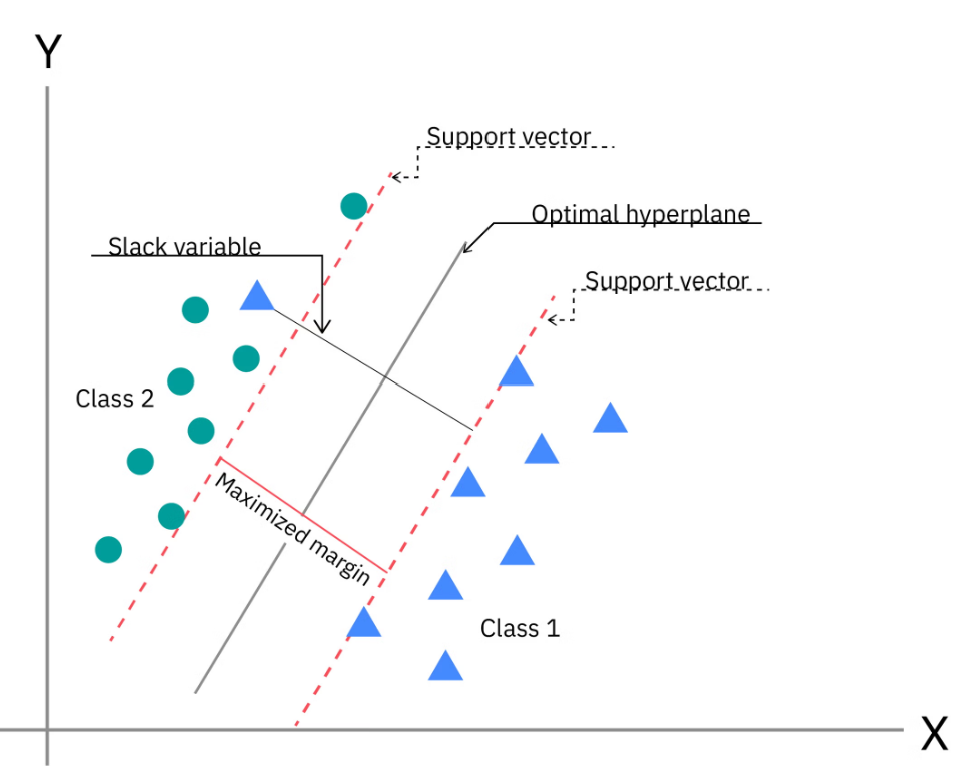

# Support Vector Machine (SVM)

**Support Vector Machine (SVM)** is a powerful and versatile supervised machine learning algorithm primarily used for **linear and non-linear classification**, although it can also be extended to **regression** problems. The fundamental idea behind SVM is to find an optimal **hyperplane** that separates data points belonging to different classes. A **hyperplane** is a mathematical decision boundary that divides a feature space into two regions. In a two-dimensional space, the hyperplane is a **line**; in three dimensions, it is a **plane**; and in higher-dimensional spaces, it is referred to as a **hyperplane**. For a binary classification problem, SVM searches for the hyperplane that not only separates the different classes but also **maximizes the margin**, i.e., the margin is the distance between the closest support vectors of the two classes. 

Therefore, we can define a Support Vector Machine as:

> **A Support Vector Machine (SVM) is a supervised machine learning algorithm that classifies data by finding an optimal decision boundary (hyperplane) that maximizes the margin between different classes in an N-dimensional feature space.**

The data points closest to the optimal hyperplane are called **support vectors**. These points play a critical role in determining the position and orientation of the decision boundary. 

**Fig. 1.** Illustration of the optimal hyperplane, margin, and support vectors in SVM.

